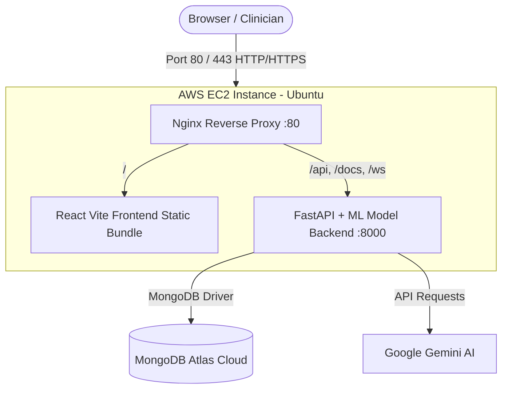

# ☁️ AWS Cloud Deployment Guide — MedInsight AI

This guide explains how to deploy **MedInsight AI** on **Amazon Web Services (AWS)**.

---

## 🎯 Recommended Option: AWS EC2 (Free Tier Eligible)

Deploy the complete full-stack app (React Frontend + FastAPI ML Backend + Nginx Reverse Proxy) on a single **AWS EC2 Free Tier** instance.



---

### 🚀 Step 1: Launch an AWS EC2 Instance

1. Log into your [AWS Management Console](https://console.aws.amazon.com/).
2. Navigate to **EC2** ➔ Click **Launch Instance**.
3. **Name:** `medinsight-ai-server`
4. **OS Image (AMI):** Select **Ubuntu Server 24.04 LTS** (or 22.04 LTS) (Free tier eligible).
5. **Instance Type:** Select **`t2.micro`** or **`t3.micro`** (Free tier eligible) *(or `t3.small` / `t4g.small` for faster ML inference)*.
6. **Key Pair (login):** 
   - Choose an existing key pair or click **Create new key pair**.
   - Download the `.pem` file (e.g., `medinsight-key.pem`) and keep it safe.
7. **Network Settings (Security Group):**
   Check the following inbound rule boxes:
   - ✅ **Allow SSH traffic from:** Anywhere (`0.0.0.0/0`) or My IP
   - ✅ **Allow HTTP traffic from the internet** (Port 80)
   - ✅ **Allow HTTPS traffic from the internet** (Port 443)
8. **Configure Storage:** Change storage from `8 GiB` to **`20 GiB`** gp3 (Free tier includes up to 30 GiB of EBS storage).
9. Click **Launch Instance**.

---

### 🔑 Step 2: Connect to Your EC2 Instance

Open your local terminal (PowerShell, Command Prompt, or Git Bash):

```bash
# Set proper permissions on your downloaded key (Linux/Mac)
chmod 400 medinsight-key.pem

# SSH into your EC2 instance (replace with your EC2 Public IPv4 address or DNS)
ssh -i "medinsight-key.pem" ubuntu@<YOUR-EC2-PUBLIC-IP>
```

---

### ⚡ Step 3: Run the 1-Command Automated Deployer

Once inside the EC2 instance, simply run:

```bash
# 1. Clone your repository
git clone <YOUR-GITHUB-REPO-URL>
cd cognizant/medinsight-ai   # or cd <repo-folder>/medinsight-ai

# 2. Run the automated deployment script
bash deploy-aws-ec2.sh
```

**What this script automatically does for you:**
- Installs Docker & Docker Compose plugin.
- Configures 2GB Swap Memory (ensures ML libraries run smoothly without OOM on micro instances).
- Builds the optimized production Docker images.
- Starts Nginx reverse proxy on Port 80 routing all frontend, `/api/`, `/docs`, and WebSocket `/ws/` connections.

---

### 🌐 Step 4: Access Your Live Application

Open your browser and visit:
- **Application UI:** `http://<YOUR-EC2-PUBLIC-IP>`
- **Interactive Swagger API Docs:** `http://<YOUR-EC2-PUBLIC-IP>/docs`

---

## 🔒 Optional: Add Free Domain & SSL/HTTPS (Certbot)

To enable `https://`:

1. Point your domain (or free dynamic DNS like [DuckDNS](https://www.duckdns.org) or [No-IP](https://www.noip.com)) to your `<YOUR-EC2-PUBLIC-IP>`.
2. On your EC2 terminal:
   ```bash
   sudo apt-get install -y certbot python3-certbot-nginx
   sudo certbot --nginx -d yourdomain.com
   ```

---

## 🛠️ Useful Management Commands on EC2

| Action | Command |
|---|---|
| **View Live Logs** | `sudo docker compose -f docker-compose.aws.yml logs -f` |
| **Restart Services** | `sudo docker compose -f docker-compose.aws.yml restart` |
| **Stop Services** | `sudo docker compose -f docker-compose.aws.yml down` |
| **Rebuild & Update** | `git pull && sudo docker compose -f docker-compose.aws.yml up -d --build` |
| **Check Container Status**| `sudo docker ps` |

---

## ☁️ Alternative AWS Option: AWS App Runner + S3/CloudFront

If you prefer serverless containers without managing a VM:

1. **Backend:**
   - Go to **AWS App Runner** in the AWS Console.
   - Source: Connect your GitHub repository (`medinsight-ai/backend`).
   - Runtime: Python 3 / Dockerfile.
   - Set environment variables (`MONGODB_URL`, `JWT_SECRET_KEY`, `GENAI_API_KEY`).
   - App Runner provisions automatic scaling and an HTTPS URL.
2. **Frontend:**
   - Run `npm run build` inside `medinsight-ai/frontend`.
   - Upload `dist/` contents to an **Amazon S3 Bucket** with static web hosting enabled.
   - Point an **AWS CloudFront** distribution to the S3 bucket for low-latency worldwide CDN delivery.
