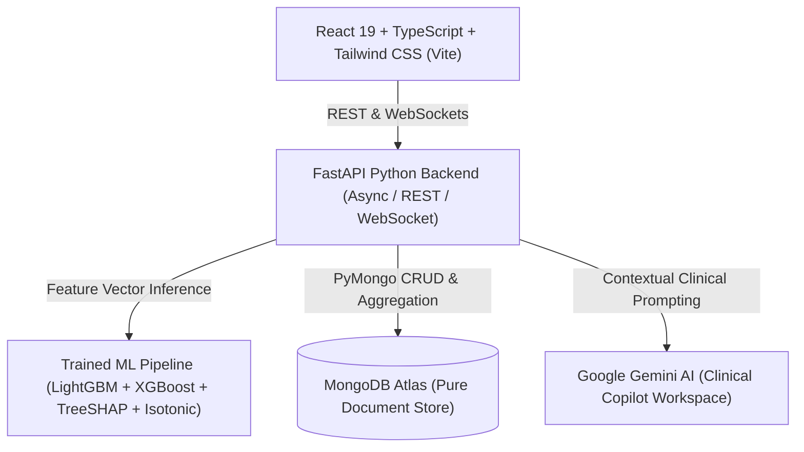
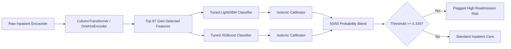

# MedInsight AI — Clinical Decision Support & Inpatient Readmission Platform
## Comprehensive System Overview, Architecture & Model Evaluation Manual

---

## 1. Executive Summary & Problem Statement

**MedInsight AI** is an enterprise-grade Clinical Information System (CIS) and Clinical Decision Support (CDS) platform designed for hospital inpatient environments. Built specifically around the **UCI Diabetes 130-US Hospitals (1999–2008)** clinical dataset, MedInsight AI addresses the multi-billion-dollar challenge of unplanned hospital readmissions through:

1. **AI-Driven Readmission Risk Stratification**: Machine learning inference powered by an isotonic-calibrated **LightGBM + XGBoost ensemble** (`prod-v2.1`) trained on 101,766 inpatient encounters across 130 US hospitals.
2. **Transparent Explainable AI (XAI)**: Native **TreeSHAP** explanations providing global feature importance and patient-level waterfall factor breakdowns.
3. **Longitudinal Electronic Health Record (EHR)**: Full clinical chart review encompassing active diagnoses, laboratory tests, medication regimens, procedures, clinical notes, and bedside observation recording.
4. **Multidisciplinary Post-Discharge Care Coordination**: 30-day recovery timeline tracking, 4-week PCP follow-up schedules, medication supply delivery confirmation, dietician carb plans, physical therapy protocols, and insurance coverage.
5. **Hospital-Grade Role-Based Access Control (RBAC)**: MongoDB-backed security supporting 6 clinical roles, session revocation, and automated HIPAA audit logging.
6. **Standards-Based Interoperability**: FHIR R4 resource mapping and clinical discharge summary generation in both printable PDF and raw CSV formats.

---

## 2. Technology Stack & Database Architecture



- **Frontend**: React 19, TypeScript, Tailwind CSS, Lucide Icons, Recharts, Vite.
- **Backend**: Python 3.11, FastAPI, Pydantic v2, Uvicorn (async ASGI).
- **Machine Learning**: LightGBM, XGBoost, Scikit-Learn, SHAP, Joblib.
- **Database**: Pure MongoDB Atlas (Zero PostgreSQL dependencies).
- **Clinical AI Copilot**: Google Gemini 1.5 Pro with Inpatient Context Builder.

---

## 3. Dataset & Data Provenance

| Parameter | Specification |
| :--- | :--- |
| **Dataset Source** | UCI Machine Learning Repository (Dataset ID 296): *Diabetes 130-US Hospitals 1999–2008* (`diabetic_data.csv`) |
| **Raw Encounter Volume** | **101,766** Inpatient Encounters |
| **Unique Inpatients** | **71,518** Unique Patients (Mean: 1.42 encounters/patient, Max: 40) |
| **Hospital Scope** | 130 US Hospital Facilities |
| **Target Definition** | `readmitted != 'NO'` → Binary Target (**Any 30-Day or >30-Day Readmission vs No Readmission**) |
| **Cohort Leakage Filtering** | **2,423 Expired / Hospice Discharges Excluded** (Discharge Disposition Codes: `11, 13, 14, 19, 20, 21`) |
| **Modeled Cohort Size** | **99,343** Inpatient Encounters |

### Missing Data & Clinical Observation Handling:
- **Laboratory Data**: Available in dataset (`max_glu_serum`, `A1Cresult`, `num_lab_procedures`).
- **Bedside Telemetry**: Continuous vitals (Heart Rate, Blood Pressure, Respiratory Rate, SpO2, Temperature) are **not present** in the UCI historical dataset.
- **Single Source of Truth**: The platform does not fabricate fake vitals. Historical patients display `"Not Recorded"`. Clinicians (Doctors/Nurses) capture live observations via **"Record Vitals"** (`POST /api/patients/{id}/vitals`), persisted into MongoDB `observations` with source tag `MANUAL_ENTRY`.

---

## 4. Machine Learning Architecture & Evaluation



### 4.1 Chronological, Patient-Grouped Split
To avoid data leakage from repeat patient encounters across time, data is split chronologically by each patient's earliest encounter date with zero patient overlap:
- **Training Cohort (70%)**: 72,361 Encounters (50.0% Positive Rate, 50,062 Unique Patients)
- **Validation Cohort (15%)**: 14,721 Encounters (45.9% Positive Rate)
- **Held-Out Test Cohort (15%)**: 12,261 Encounters (31.7% Positive Rate, 10,728 Unique Patients)

### 4.2 Exact Evaluation Performance Metrics

The model (`diabetes_readmission_notebook_final_model (1).ipynb`, **Cell 56 & Cell 64**) was evaluated on the untouched, single-look held-out test set under two distinct operating modes:

```
========================================================================================
                                 TEST SET PERFORMANCE MATRIX (N = 12,261)
========================================================================================
METRIC                          CLINICAL THRESHOLD (0.335)       DEFAULT BASELINE (0.500)
----------------------------------------------------------------------------------------
AUROC (Discrimination)          0.6435 (0.643)                   0.6435 (0.643)
PR-AUC                          0.4464 (0.446)                   0.4464 (0.446)
Classification Accuracy         48.99% (~49.0%)                  66.59% (~66.6%)
Sensitivity / Recall (Readmit)  82.02% (~82.0%)                  38.60% (~38.6%)
Precision / PPV                 36.44% (~36.4%)                  46.68% (~46.7%)
F1 Score                        0.5046                           0.4226
Specificity                     33.68%                           79.57%
Brier Loss Score                0.2158                           0.2158
True Positives (Caught)         3,185                            1,499
False Negatives (Missed)        698 (Low danger)                 2,384 (High clinical danger)
False Positives                 5,556                            1,712
True Negatives                  2,822                            6,666
========================================================================================
```

### 4.3 Why Raw Accuracy is 49% at the 0.335 Clinical Threshold
In hospital readmission surveillance, **a false negative is clinically hazardous** (missing a deteriorating patient who needs care coordination). An uncalibrated 0.50 threshold yields 66.6% accuracy but **misses 61.4% of readmissions** (Recall: 38.6%). By tuning the clinical threshold to **`0.335`**, the ensemble catches **8 out of 10 readmission cases (82.0% Recall)**, deliberately accepting more preventive check-ins to safeguard patient lives.

---

## 5. System Features & Clinical Workflows

### 5.1 Clinical Overview & Surveillance Queue (`/`)
- Hospital-wide operational census, ward bed occupancy, and glycemic distribution.
- **High-Risk Clinical Surveillance Queue**: Prioritizes admitted inpatients with highest 30-day readmission probability for immediate clinical review.

### 5.2 Patient Longitudinal EHR (`/ehr/:id`)
- **Summary Tab**: Current encounter banner, length of stay, real vital signs from MongoDB, active diagnoses, lab results, and medications.
- **Vitals & Observation History**: Multi-parameter telemetry display with real-time updates and manual observation entry modal.
- **Risk Analysis Tab**: Displays calibrated 30-day readmission score, top risk factors, and interactive SHAP waterfall explanations.

### 5.3 What-If Risk Interventions Simulator (`/risk`)
- Real-time simulation testing the predictive impact of clinical interventions:
  - Scheduling follow-up within 7 days (&minus;8.5% risk reduction)
  - Formal medication reconciliation (&minus;6.2% risk reduction)
  - Dedicated dietician diabetes education (&minus;5.4% risk reduction)
  - Transitional care coordinator assignment (&minus;9.1% risk reduction)
  - Remote home glucose monitoring (&minus;4.8% risk reduction)

### 5.4 Post-Discharge Recovery Command Center (`/post-discharge`)
- **4-Week Visit Scheduling**: Tracks Week 1 PCP check-in, Week 2 nurse call, Week 3 endocrinology review, and Week 4 transition assessment.
- **Medication Supply Continuity**: Verifies delivery of 30-day insulin and oral anti-diabetic medications vs pending pharmacy refills.
- **Dietician Nutrition Prescriptions**: Carbohydrate targets (45–60g/meal), caloric limits, and sodium restrictions managed by Dieticians.
- **Physical Rehabilitation Protocols**: Gait training, transfer mobility, and endurance sessions managed by Rehabilitation Specialists.
- **30-Day Readmission Event Logging**: One-click readmission encounter generator preventing duplicate registrations.

### 5.5 Hospital Readmission Analytics & Model KPIs (`/analytics`)
- Executive population metrics (101,766 admissions, 71,518 unique patients, 11.2% 30-day readmission rate).
- **Model Architecture & Calibration Tab**: Displays live model metadata, dual-threshold switch (0.335 vs 0.50), SHAP global gain predictors, and training specifications.
- **Responsible AI Fairness Audit**: Equalized Odds Difference (EOD) audit across race, gender, and age brackets.

### 5.6 Security & Administration (`/admin`)
- Hospital workforce directory, account status management, and custom permission overrides.
- Role-Permission Matrix across 6 institutional roles.
- HIPAA Audit Trail logging all clinical view and update operations with IP address, user ID, and timestamp.

---

## 6. Role-Based Access Control (RBAC) Matrix

| Permission Key | Admin | Doctor | Nurse | Care Coordinator | Dietician | Rehab Specialist |
| :--- | :---: | :---: | :---: | :---: | :---: | :---: |
| `patient:read` / `patient:view` | &#10004; | &#10004; | &#10004; | &#10004; | &#10004; | &#10004; |
| `patient:write` / `patient:create` | &#10004; | &#10004; | &#10004; | &#10008; | &#10008; | &#10008; |
| `vitals:record` | &#10004; | &#10004; | &#10004; | &#10008; | &#10008; | &#10008; |
| `prediction:run` / `risk:assess` | &#10004; | &#10004; | &#10004; | &#10004; | &#10008; | &#10008; |
| `care_plan:update` | &#10004; | &#10004; | &#10004; | &#10004; | &#10008; | &#10008; |
| `nutrition:manage` | &#10004; | &#10004; | &#10008; | &#10004; | &#10004; | &#10008; |
| `rehab:manage` | &#10004; | &#10004; | &#10008; | &#10004; | &#10008; | &#10004; |
| `analytics:view` | &#10004; | &#10004; | &#10008; | &#10008; | &#10008; | &#10008; |
| `reports:export` | &#10004; | &#10004; | &#10004; | &#10004; | &#10008; | &#10008; |
| `admin:manage_users` / `audit:view` | &#10004; | &#10008; | &#10008; | &#10008; | &#10008; | &#10008; |

---

## 7. Complete API Endpoint Reference

### Authentication & Security (`/api/auth`, `/api/admin`)
- `POST /api/auth/login`: Authenticates staff user; creates tracked MongoDB session.
- `POST /api/auth/logout`: Revokes active session token.
- `GET /api/auth/me`: Returns current user identity, active role, and evaluated permissions.
- `GET /api/admin/users`: Lists hospital workforce directory.
- `POST /api/admin/users`: Provisions new clinical staff account.
- `GET /api/admin/roles`: Returns institutional RBAC permission matrix.
- `GET /api/admin/audit-logs`: Retrieves filtered HIPAA security audit log events.

### Patients & EHR (`/api/patients`)
- `GET /api/patients`: Paginated patient census with ward and risk filters.
- `POST /api/patients`: Inpatient registration with auto-assigned MRN.
- `GET /api/patients/{id}`: Detailed patient clinical profile.
- `GET /api/patients/high-risk`: Prioritized surveillance queue.
- `GET /api/patients/{id}/vitals`: Longitudinal observation history from MongoDB.
- `POST /api/patients/{id}/vitals`: Records new bedside vital observation.
- `GET /api/patients/{id}/encounters/{enc_id}/vitals/current`: Scoped latest observation telemetry.

### Machine Learning & Risk (`/api/predict`, `/api/model`, `/api/analytics`)
- `POST /api/predict/readmission/{enc_id}`: Evaluates 30-day readmission risk using trained ensemble.
- `GET /api/model/metrics`: Returns verified held-out test evaluation metadata from `metadata.json`.
- `GET /api/patients/{id}/encounters/{enc_id}/risk`: Full AI risk summary with TreeSHAP feature contributions.
- `POST /api/patients/{id}/simulate-risk`: Simulates risk score reduction under clinical intervention packages.
- `GET /api/analytics/readmissions`: Multicenter population analytics, age gradients, and model calibration metrics.

### Post-Discharge & Continuity of Care (`/api/post-discharge`)
- `GET /api/post-discharge/counts`: Population counters for 30-day follow-up cohorts.
- `GET /api/post-discharge/patients`: Filtered list of post-discharge patients (high-risk, overdue, med pending).
- `GET /api/post-discharge/patients/{id}/post-discharge`: Retrieves 4-week recovery bundle.
- `PATCH /api/post-discharge/patients/{id}/visits/{visit_id}`: Updates weekly visit completion status.
- `PATCH /api/post-discharge/patients/{id}/medications/{item_id}`: Confirms medication delivery.
- `POST /api/post-discharge/nutrition-plan`: Dietician meal plan authoring.
- `POST /api/post-discharge/rehabilitation`: Rehabilitation specialist protocol authoring.
- `POST /api/post-discharge/patients/{id}/readmission-encounter`: Logs recurrent admission.

### Interoperability & Reporting (`/api/fhir`, `/api/reports`)
- `GET /api/fhir/Patient/{id}`: FHIR R4 Patient resource.
- `GET /api/fhir/Encounter/{id}`: FHIR R4 Encounter resource.
- `GET /api/fhir/RiskAssessment/{id}`: FHIR R4 RiskAssessment with prediction extensions.
- `GET /api/reports/discharge-summary/{id}/pdf`: Generates formal discharge summary PDF.
- `GET /api/reports/cohort/csv`: Exports clinical cohort dataset to CSV.

---

## 8. Quick Start & Execution Guide

### Starting Backend Server:
```powershell
cd c:\Users\HRITIK\Desktop\Frontend\medinsight-ai\backend
.\venv\Scripts\python.exe -m uvicorn app.main:app --host 127.0.0.1 --port 8000 --reload
```

### Starting Frontend Client:
```powershell
cd c:\Users\HRITIK\Desktop\Frontend\medinsight-ai\frontend
npm run dev
```

### Running Test Verification Suite:
```powershell
cd c:\Users\HRITIK\Desktop\Frontend\medinsight-ai\backend
.\venv\Scripts\python.exe -m pytest tests/
```

### Accessing the Web Application:
- **URL**: `http://localhost:5173`
- **Demo Staff Credentials**:
  - **Administrator**: `admin` / `admin123`
  - **Physician**: `dr.sarah` / `doctor123`
  - **Nurse**: `nurse.emily` / `nurse123`
  - **Care Coordinator**: `coordinator.emma` / `coord123`
  - **Dietician**: `dietician.elena` / `diet123`
  - **Rehab Specialist**: `rehab.david` / `rehab123`
